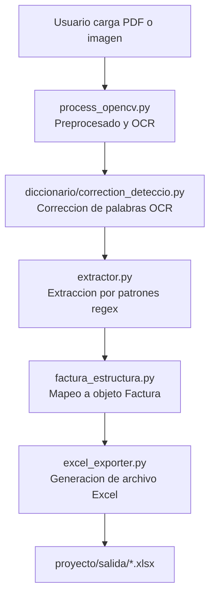

# Conversor de Facturas a Excel

Aplicacion de escritorio para automatizar la lectura de facturas y su transformacion a Excel.

## Problema y contexto

En muchas empresas, la carga de facturas se hace de forma manual: abrir PDF o imagen, leer campos, y transcribirlos a Excel.

Este proceso genera:

- Tiempo operativo alto por tarea repetitiva.
- Errores humanos en montos, fechas y documentos.
- Baja escalabilidad cuando aumenta el volumen de facturas.

Este proyecto resuelve ese problema con un flujo semiautomatico: recibe factura en PDF o imagen, aplica OCR con EasyOCR, extrae campos estructurados y genera un Excel listo para uso interno.

## Solucion implementada

- Entrada: `.pdf`, `.jpg`, `.jpeg`, `.png`, `.tiff`, `.bmp`, `.webp`
- OCR principal: EasyOCR (CPU)
- Correccion OCR: diccionario de palabras para reemplazar detecciones incorrectas
- Extraccion de campos: expresiones regulares + normalizacion de texto
- Estructuracion: modelo `Factura` con proveedor, cliente, totales e items
- Salida: Excel con hoja `Factura` y hoja `Items`

## Flujo del programa



## Tecnicas y conceptos usados

### Vision por computador y OCR

- EasyOCR para reconocimiento de texto en facturas escaneadas.
- Preprocesado de imagen (escala, gris, binarizacion) para mejorar lectura.
- Soporte combinado PDF texto + OCR cuando el PDF no trae texto seleccionable.

### Procesamiento de texto

- Normalizacion de texto OCR (espacios, simbolos y variantes).
- Diccionario de correccion para errores comunes de OCR.
- Extraccion deterministica con regex por campo (numero, RUC, fecha, subtotal, IGV, total).

### Modelado y exportacion

- Modelo de dominio `Factura` para desacoplar OCR de salida.
- Exportacion con `openpyxl` a formato legible para operacion.
- Hoja de resumen + hoja de detalle de items.

## Estado actual y alcance

- El proyecto automatiza la transformacion de factura a Excel.
- Flujo actual: archivo de entrada -> OCR -> extraccion -> Excel.
- Siguiente etapa (roadmap): carga automatica a base de datos.

## Estructura del proyecto

```text
transformamiendo de facturas a excel/
├─ proyecto/
│  ├─ src/
│  │  ├─ main_tk.py             # UI principal (Tkinter)
│  │  ├─ process_opencv.py      # OCR y procesamiento de entrada
│  │  ├─ extractor.py           # Extraccion de campos
│  │  ├─ factura_estructura.py  # Modelo de factura
│  │  └─ excel_exporter.py      # Exportacion a Excel
│  └─ salida/                   # Excels generados
├─ diccionario/
│  └─ correction_deteccio.py    # Correccion de texto OCR
├─ requirements.txt
└─ run.sh
```

## Instalacion y ejecucion

### 1. Crear/activar entorno virtual

```bash
# Linux/Mac
python -m venv venv
source venv/bin/activate

# Windows (PowerShell)
python -m venv venv
venv\Scripts\Activate.ps1
```

### 2. Instalar dependencias

```bash
pip install -r requirements.txt
```

### 3. Ejecutar

```bash
# Linux/Mac
chmod +x run.sh
./run.sh

# Cualquier sistema
python proyecto/src/main_tk.py
```

## Dependencias del sistema (importante)

- `pdf2image` requiere Poppler para procesar PDF por imagen.
- En Windows debes tener Poppler instalado y en `PATH`.

## Como adaptar a otro tipo de factura

### Vista general

1. Define nuevos campos del negocio (retencion, OC, centro de costo, etc.).
2. Ajusta reglas de lectura para el layout del nuevo formato.
3. Mapea esos campos al modelo `Factura`.
4. Actualiza la exportacion Excel con columnas/secciones nuevas.

### Vista tecnica (archivo por archivo)

1. OCR y preprocesado: `proyecto/src/process_opencv.py`
2. Diccionario OCR: `diccionario/correction_deteccio.py`
3. Reglas de extraccion (regex): `proyecto/src/extractor.py`
4. Modelo de datos: `proyecto/src/factura_estructura.py`
5. Salida Excel: `proyecto/src/excel_exporter.py`
6. Integracion UI: `proyecto/src/main_tk.py`

## Estrategia de commits (recomendada)

Usa commits pequenos y descriptivos. Formato sugerido:

```text
tipo(scope): descripcion corta
```

Ejemplos:

```text
feat(extractor): agrega deteccion de fecha de vencimiento
fix(ocr): mejora preprocesado para facturas escaneadas
docs(readme): documenta flujo y arquitectura
refactor(model): separa mapeo de proveedor y cliente
```

## Notas finales

- Este repositorio esta orientado a automatizacion de facturas para empresas.
- La salida actual es Excel para acelerar operaciones administrativas.
- La integracion con base de datos queda como siguiente fase del proyecto.
